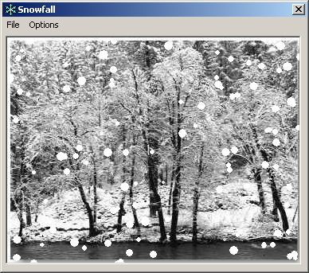



## Snowfall

### Description

This is a snowfall animation that I done a while back now. Its not amazing code by anyones standards but it shows you how to manipulate arrays and it looks quite nice. It uses a picture box for the drawing routines. You can change a few elements in the app to really test your processing power, anyways, get it, comment it and vote it. Thanks. Nick :)
 
### More Info
 

             |
---                |---
**Submitted On**   |2001-05-12 10:27:30
**By**             |[Niknak\!\!](https://github.com/Planet-Source-Code/PSCIndex/blob/master/ByAuthor/niknak.md)
**Level**          |Advanced
**User Rating**    |4.3 (17 globes from 4 users)
**Compatibility**  |VB 3\.0, VB 4\.0 \(16\-bit\), VB 4\.0 \(32\-bit\), VB 5\.0, VB 6\.0
**Category**       |[Graphics](https://github.com/Planet-Source-Code/PSCIndex/blob/master/ByCategory/graphics__1-46.md)
**World**          |[Visual Basic](https://github.com/Planet-Source-Code/PSCIndex/blob/master/ByWorld/visual-basic.md)
**Archive File**   |[Snowfall195385122001\.zip](https://github.com/Planet-Source-Code/niknak-snowfall__1-23134/archive/master.zip)

